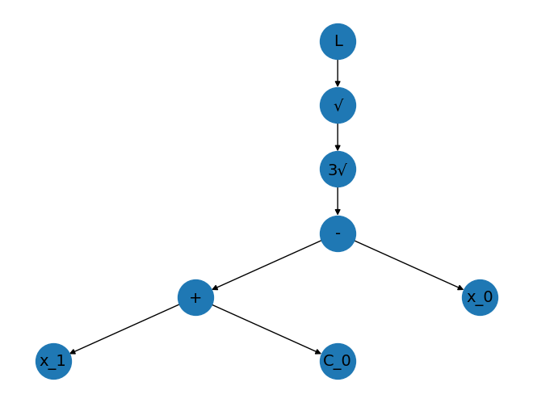

# Botfip (Bootstrapping OTS-Funcimg Pre-training Symbolic Computing Model)

Botfip is a multimodal framework for symbolic regression and scientific computation in the MED domain. Through contrastive learning training within Botfip, we can unearth the deep-seated correlations between function images and symbolic computation. Botfip enables us to analyze unknown function images, thereby providing their symbolic expressions and accomplishing symbolic regression tasks. Beyond this, Botfip possesses extensive extensibility. As a MED framework, Botfip holds promise for future applications in a broader range of scientific computing problems.


## Quickstart
Notice: The code is still under development, there are many areas that need to be optimized in the subsequent code,  we will release the full version soon.
### 1. Operation Symbolic System
The symbolic computation system of this framework primarily operates under the operation module.


#### Determine config path adn Randomly create and initialize the symbol tree
```
from Botfip.operation.operation_tree import OperationRandomTree
hyperparameters_yaml_path = 'configs/model_hyper.yaml'
opt = OperationRandomTree.from_config_yaml(8,hyperparameters_yaml_path)
opt.random_assign_operations()
print(opt.to_formula_str()) # print the string formula of the tree
opt.draw_tree() # draw the tree
```
1.88*Abs((-x_0 + x_1 - 0.858)**(1/3))**0.5 - 0.273



#### Operation Tree Encoding and Reconstruction
##### Encode the Operation Tree
```
ots,const = opt.tree_serialized_encode_seq(if_ignore_root = True)
print(ots,const)
```
[16, 0, 17, 0, 2, 0, 1, 18, 0, 19, 10, 0, 0, 0, 0] [-0.85762299  1.88441416 -0.27345497]


##### Reconstruct the Operation Tree
```
opt_reco = OperationRandomTree.load_tree_ots(opseq,hyperparameters_yaml_path,constant_array=op_constant)
print(opt_reco.to_formula_str(type='full'))
```
1.88*Abs((-x_0 + x_1 - 0.858)**(1/3))**0.5 - 0.273

### 2. Dataset generation/ Download
Run the data generate.py script under script
```
python script/data_generate.py
```
or you can download here: https://pan.baidu.com/s/19LCXjz7JILCWdQMFpsuNgw 

### 3. train the model
You can run the train.py file on a single gpu
```
python train.py
```
Or you can enable ddp for single-machine multi-card running (using four-card gpu as an example)
```
torchrun --nproc_per_node 4 train.py
```

### 4. valid the model
```
load_dataset_path = ... # the dataset path
config_yaml = ... # the config yaml file of the model
set_node_num = ... # the node number of the operation tree
botfip_trainer =Botfip_trainer.build_from_yaml(config_yaml,if_ddp=False,load_path = load_path,set_node_num=set_node_num)
val_dataset =  Op_dataset(config_yaml,if_load=True,dataset_key='op_dataset_config',load_dataset_path=load_dataset_path)
val_dataloader = DataLoader(val_dataset, batch_size=20, collate_fn=custom_collate,shuffle=True,drop_last=True,num_workers=0)
botfip_trainer.validation(val_dataloader,test_num_limit=1000,if_cal_mse=False,set_node_num=set_node_num)
```
{'rl_metric': tensor(0.9001),
 'ots_rationality_metric': tensor(1.),
 'opstr_levenshtein_metric': tensor(0.9001)}

### 5. inference / usage
Firstly, you need to load the model

```
load_path = ... # the model path
botfip_trainer =Botfip_trainer.build_from_yaml(config_yaml,if_ddp=False,load_path = load_path)
```
Then, generate the ots from funcimg

```
multi_scale_funcimg = ... # the funcimg after multi-scale processing and normalization
original_funcimg = ... # the original funcimg
ots,const = botfip_trainer.model.opseq_generate(funcimg,device='cuda')
ots,const = botfip_trainer.model.tokenizer.detoeknize(ots,const)
```
Finally, use lbfgs to optimize the const_array
```
mesh_dataset = Multiscale_MeshDataset(sys_range = (-1,1),
                                      multiscale_channels = 3,
                                      max_var_types = config.operation_tree_config.max_var_types,
                                      img_shape = 64)
meshgrid = mesh_dataset.mesh # target meshgird

const_array,pred_funcimg,loss = botfip_trainer.model.const_update(hyperparameters_yaml_path,
                                                                  ots,
                                                                  original_funcimg,
                                                                  target_mesh_grid,
                                                                  optimizer='lbfgs')
```
This completes the framework for deducing possible ots and values through funcimg.

## Acknowledgement
We thank the authors of the following repositories for their open-source code, which has been of great help to our research @jsmy-CTH @Peter-Bloomberg. At the same time, we would like to thank MFEducation for their support and assistance. In addition, our code development mainly refer to the https://github.com/salesforce/LAVIS project, in this thank salesforce very much for their excellent work.


## Citation
If you find this code useful in your research, please cite:
```
@misc{chen2024bootstrapping,
      title={Bootstrapping OTS-Funcimg Pre-training Model (Botfip) -- A Comprehensive Symbolic Regression Framework}, 
      author={Tianhao Chen and Pengbo Xu and Haibiao Zheng},
      year={2024},
      eprint={2401.09748},
      archivePrefix={arXiv},
      primaryClass={cs.SC}
}
```